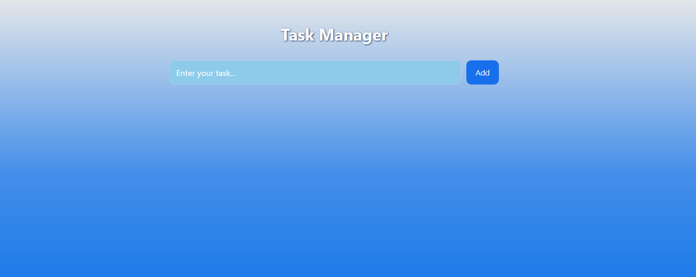
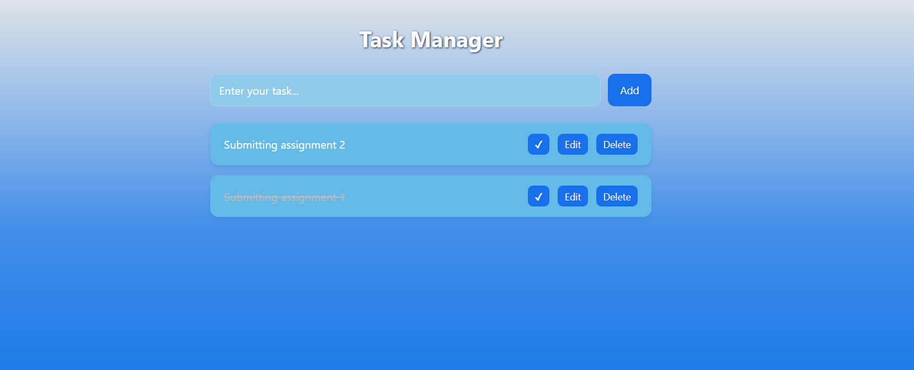

<div align="center">

#  Task Manager

### Productivity • Task Tracking • Clean Workflow Management

<p>
A web-based task management application designed to help users organize, track, and manage daily tasks efficiently with a clean and intuitive interface.
</p>

<br/>

<a href="YOUR_LIVE_LINK_HERE" target="_blank">
  
</a>

<br/><br/>


</div>

---

## Overview

**Task Manager** is a simple yet effective web application that allows users to manage their daily tasks in an organized manner.

The application enables users to create, update, and delete tasks while maintaining a clear overview of pending and completed work.

It focuses on usability, simplicity, and efficient task handling.

---

## Screenshots

<div align="center">

| Task Dashboard | Add / Manage Tasks |
|----------------|--------------------|
|  |  |

</div>

---

## Explanation of UI

- **Task Dashboard**  
  Displays a list of all tasks with their current status. Users can quickly view pending and completed tasks.

- **Add / Manage Tasks Section**  
  Allows users to:
  - Create new tasks  
  - Edit existing tasks  
  - Delete tasks  
  - Mark tasks as completed  

This provides a complete workflow for task management.

---

## Key Features

- Create new tasks  
- Update existing tasks  
- Delete tasks  
- Mark tasks as completed  
- Persistent storage using database  
- Clean and responsive interface  
- Simple and intuitive user experience  

---

## Technology Stack

<div align="center">

| Category | Technology |
|----------|-----------|
| Backend |  Python |
| Framework |  Flask |
| Frontend |  HTML |
| Styling |  CSS |
| Database |  SQLite |

</div>

---

## Project Structure

```
10_Task_Manager/
├── app.py
├── database/
│   └── tasks.db
├── templates/
│   ├── index.html
│   └── edit.html
├── static/
│   └── style.css
└── assets/
    ├── dashboard.png
    └── manage.png
```

---

## How It Works

1. User opens the application  
2. Tasks are fetched from the database  
3. User can:
   - Add new tasks  
   - Edit tasks  
   - Delete tasks  
   - Mark tasks as completed  
4. Changes are saved and reflected instantly  

---

## Getting Started

### Prerequisites

- Python 3.8+  
- pip  

---

### Installation

```bash
git clone https://github.com/priyanildz/Task-Manager.git
cd Task-Manager
```

```bash
python -m venv venv
```

```bash
# Windows
venv\Scripts\activate

# macOS/Linux
source venv/bin/activate
```

```bash
pip install -r requirements.txt
```

---

## Run Application

```bash
python app.py
```

Open:

```
http://127.0.0.1:5000
```

---

## Use Cases

- Daily task tracking  
- Productivity management  
- Learning CRUD operations  
- Backend + database integration practice  

---

## Future Improvements

- User authentication  
- Task categories / tags  
- Deadlines and reminders  
- Drag-and-drop UI  
- Mobile responsiveness enhancements  

---

## License

This project is licensed under the MIT License.

---

<div align="center">

Developed by  
<strong>priyanildz</strong>

</div>